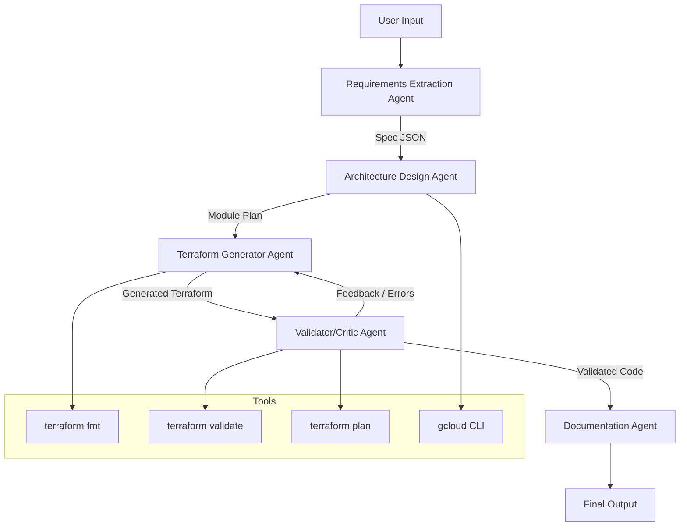
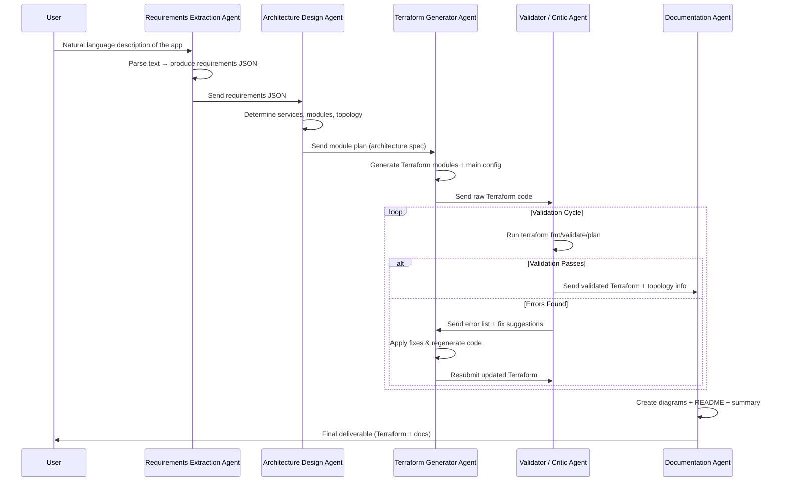

# Terraform Generator Multi-Agent System

[](https://www.python.org/downloads/)
[](https://google.github.io/adk-docs/)
[](https://www.terraform.io/)
[](LICENSE)

A sophisticated multi-agent system built with Google ADK that generates GCP Terraform infrastructure code from natural language descriptions.

> 🏆 **Built for Kaggle 5-Day AI Agents Competition** - Demonstrating advanced multi-agent orchestration and tool integration
> 
> 🔒 **Safe by Design** - Generates code only, never executes infrastructure changes. See [SECURITY.md](SECURITY.md)
> 
> ⚠️ **Testing Recommended** - Generated code is validated for syntax but should be tested in an isolated GCP project before production use. See [TESTING.md](TESTING.md)

## 🎯 Overview

This project demonstrates a multi-agent architecture where specialized agents collaborate to:
1. Extract requirements from natural language descriptions
2. Design GCP infrastructure architecture
3. Generate Terraform code
4. Validate and critique the generated code
5. Create comprehensive documentation

## 🏗️ Architecture



## 🤖 Agent Roles

### Requirements Extraction Agent
- Parses natural language descriptions
- Extracts structured requirements (compute, storage, networking, etc.)
- Outputs JSON specification

### Architecture Design Agent
- Receives requirements JSON
- Designs GCP service topology
- Determines module structure
- Uses gcloud CLI for service compatibility checks

### Terraform Generator Agent
- Generates Terraform modules and configurations
- Creates provider blocks, resources, and variables
- Uses terraform fmt for code formatting
- Produces idiomatic Terraform code

### Validator/Critic Agent
- Runs terraform validate
- Performs terraform plan (dry-run)
- Identifies errors and provides feedback
- Iterates with Generator Agent until validation passes

### Documentation Agent
- Creates architecture diagrams
- Generates README and deployment guides
- Documents variables and outputs
- Produces usage examples

## 📋 Message Passing Sequence



## 🚀 Quick Start

### Prerequisites
- Python 3.10+
- [uv](https://docs.astral.sh/uv/) - Fast Python package installer
- Google Cloud SDK (`gcloud` CLI)
- Terraform CLI
- Gemini API Key [API key in Google AI Studio](https://aistudio.google.com/app/api-keys)
- Google Cloud Project ID [https://console.cloud.google.com/](https://console.cloud.google.com/). Create a new project for testing.

### Installation

```bash
# Install uv if not already installed
curl -LsSf https://astral.sh/uv/install.sh | sh

# Clone the repository
cd /Users/macos/Code/terraform-generator-agents

# Install dependencies (creates venv automatically)
uv sync

# Set up environment variables
cp .env.example .env
# Edit .env and add:
#   GOOGLE_API_KEY=your-api-key-here
#   GOOGLE_CLOUD_PROJECT=your-gcp-project-id
```

### Usage

```bash
# Run the demo
uv run src/demo.py

# Or use the orchestrator directly
uv run python -m src.orchestrator "Create a web application with Cloud Run, Cloud SQL PostgreSQL, and Cloud Storage"
```

### Adding Dependencies

```bash
# Add a new package
uv add <package-name>

# Add a development dependency
uv add --dev pytest

# Remove a package
uv remove <package-name>
```

## 🛠️ Tools Used

- **terraform fmt**: Code formatting
- **terraform validate**: Syntax and configuration validation
- **terraform plan**: Dry-run infrastructure planning
- **gcloud CLI**: GCP service compatibility checks

## 📁 Project Structure

```
terraform-generator-agents/
├── src/
│   ├── agents/              # Specialized agent implementations
│   │   ├── requirements_agent.py
│   │   ├── architecture_agent.py
│   │   ├── generator_agent.py
│   │   ├── validator_agent.py
│   │   └── documentation_agent.py
│   ├── tools/               # Tool integrations
│   │   ├── terraform_tools.py
│   │   └── gcloud_tools.py
│   ├── orchestrator.py      # Main orchestration logic
│   └── demo.py              # Interactive demo script
├── examples/                # Working example outputs
├── pyproject.toml           # Project configuration
├── README.md
└── QUICKSTART.md
```

## 🏗️ Generated Output Structure

The system generates modular Terraform code following industry best practices:

```
output/demo_TIMESTAMP/
├── modules/                   # Reusable infrastructure components
│   ├── vpc/
│   │   ├── main.tf            # Resource definitions
│   │   ├── variables.tf       # Module inputs
│   │   └── outputs.tf         # Module outputs
│   ├── cloud_run/
│   └── cloud_sql/
│
├── environments/prod/         # Environment-specific configuration
│   ├── main.tf                # Calls modules with prod values
│   ├── variables.tf           # Environment variables
│   ├── outputs.tf             # Outputs
│   ├── provider.tf            # GCP provider setup
│   └── terraform.tfvars.example
│
└── README.md                  # Generated documentation
```

**Why Modular?**
- ✅ Reuse modules across dev/staging/prod environments
- ✅ Update once, apply everywhere
- ✅ Clear separation of infrastructure vs configuration
- ✅ Easy to test individual components

**Deploying Generated Code:**
```bash
cd output/demo_TIMESTAMP/environments/prod
cp terraform.tfvars.example terraform.tfvars
# Edit terraform.tfvars with your values
terraform init
terraform plan
terraform apply
```

## 📚 Learn More

- [QUICKSTART.md](QUICKSTART.md) - Get started in 5 minutes
- [SECURITY.md](SECURITY.md) - Security posture and safety guarantees
- [TESTING.md](TESTING.md) - How to test generated Terraform code
- [Google ADK Documentation](https://google.github.io/adk-docs/)
- [Terraform GCP Provider](https://registry.terraform.io/providers/hashicorp/google/latest/docs)
- [GCP Documentation](https://cloud.google.com/docs)

## 🐛 Troubleshooting

### Installation Issues
```bash
# Reinstall dependencies
uv sync --reinstall

# Or add individual packages
uv add google-adk google-genai pydantic python-dotenv pyyaml
```

### API Key Not Found
Ensure `GOOGLE_API_KEY` is set:
```bash
# Option 1: Add to .env file (recommended)
echo "GOOGLE_API_KEY=your-key-here" >> .env

# Option 2: Export for current session
export GOOGLE_API_KEY="your-api-key-here"
```

### Terraform/gcloud Not Found
```bash
# Install Terraform
brew install terraform  # macOS
# Or download from terraform.io

# Install gcloud CLI
brew install google-cloud-sdk  # macOS
# Or follow: cloud.google.com/sdk/docs/install
```

### Agent Timeout
Increase timeout in orchestrator.py:
```python
retry_config = RetryConfig(max_retries=5, initial_delay=3.0, timeout=300.0)
```

## 🤝 Contributing

Contributions welcome! To contribute:

1. **Fork and clone**
   ```bash
   git clone https://github.com/yourusername/terraform-generator-agents.git
   cd terraform-generator-agents
   ```

2. **Install dependencies**
   ```bash
   uv sync
   ```

3. **Create a branch**
   ```bash
   git checkout -b feature/your-feature
   ```

4. **Make changes and test**
   ```bash
   uv run src/demo.py  # Test your changes
   ```

5. **Submit pull request**

### Development Guidelines
- Follow PEP 8 style guidelines
- Add docstrings to all functions
- Test with multiple scenarios
- Update documentation for new features

## 📝 License

MIT License

## 🙏 Acknowledgments

Built as part of the Kaggle 5-Day AI Agents Competition demonstrating Google ADK capabilities.
