# TerraformAI: Multi-Agent Infrastructure as Code Generator

<p align="center">
  
</p>

[](https://www.python.org/downloads/)
[](https://google.github.io/adk-docs/)
[](https://www.terraform.io/)

> A sophisticated multi-agent system that transforms natural language into production-ready Google Cloud Platform Terraform code.

---

## 📋 Table of Contents

- [The Problem](#-the-problem)
- [The Solution](#-the-solution)
- [Architecture](#-architecture)
- [ADK Features Demonstrated](#-adk-features-demonstrated)
- [Quick Start](#-quick-start)
- [Example Usage](#-example-usage)
- [Project Structure](#-project-structure)
- [Generated Output](#-generated-output-structure)
- [How It Works](#-how-it-works)
- [Technical Stack](#-technical-stack)
- [Troubleshooting](#-troubleshooting)

---

## 🎯 The Problem

Creating production-ready Terraform configurations is a significant barrier for development teams:

| Challenge | Impact |
|-----------|--------|
| **Expertise Gap** | Writing secure, best-practice Terraform requires deep knowledge of cloud services, networking, IAM, and HCL syntax |
| **Time-Consuming Iteration** | Engineers spend hours writing, validating, and debugging configurations |
| **Quality Inconsistency** | Without rigorous review, infrastructure code often contains security vulnerabilities and anti-patterns |
| **Documentation Drift** | Infrastructure documentation lags behind implementation, making maintenance difficult |

---

## 💡 The Solution

TerraformAI solves these challenges through a **5-agent sequential pipeline** with an innovative **validation feedback loop**:

```
Natural Language → Requirements → Architecture → Generator ⟷ Validator → Documentation
                                                     ↑_______feedback loop_______↓
```

### Key Innovation: Iterative Learning

The Generator and Validator agents **share session memory**, enabling the system to **learn from mistakes** and iteratively improve until code passes validation (up to 20 cycles). This mimics how a senior engineering team would collaborate, with a code reviewer providing feedback until the code meets quality standards.

### ✨ Key Features

| Feature | Description |
|---------|-------------|
| 🧠 **Session-Based Memory** | Agents share conversation history via `InMemorySessionService` for iterative learning |
| 🔄 **Validation Loop** | Generator-Validator feedback cycle with up to 20 iterations until quality passes |
| 📦 **Modular Output** | Production structure: reusable `modules/` + environment-specific `environments/` |
| ✅ **Type-Safe Communication** | Pydantic models ensure reliable inter-agent data exchange |
| 📊 **Comprehensive Observability** | Detailed logging of every orchestration phase |
| 🎯 **Best Practices** | Follows Terraform, GCP, and security best practices |

> 🔒 **Safe by Design** - Generates code only, never executes infrastructure changes. See [SECURITY.md](SECURITY.md)

---

## 🏗️ Architecture

### System Architecture Diagram

```mermaid
flowchart TD
    subgraph Input
        A[👤 User Input<br/>Natural Language]
    end
    
    subgraph "Sequential Agent Pipeline"
        R[🔍 Requirements Agent<br/>Parse & Extract]
        P[📐 Architecture Agent<br/>Design & Plan]
        
        subgraph "Validation Loop (Shared Session)"
            G[⚙️ Generator Agent<br/>Create Terraform]
            V[✅ Validator Agent<br/>Critique & Feedback]
        end
        
        D[📝 Documentation Agent<br/>Generate Docs]
    end
    
    subgraph Output
        O[📁 Final Output<br/>Terraform + Docs]
    end
    
    A --> R
    R -->|Requirements JSON| P
    P -->|Architecture Spec| G
    G -->|Generated Code| V
    V -->|Feedback| G
    V -->|Validated Code| D
    D --> O

    style A fill:#1565C0,stroke:#0D47A1,color:#FFFFFF
    style R fill:#7B1FA2,stroke:#4A148C,color:#FFFFFF
    style P fill:#00838F,stroke:#006064,color:#FFFFFF
    style G fill:#E65100,stroke:#BF360C,color:#FFFFFF
    style V fill:#F9A825,stroke:#F57F17,color:#000000
    style D fill:#2E7D32,stroke:#1B5E20,color:#FFFFFF
    style O fill:#388E3C,stroke:#2E7D32,color:#FFFFFF
```



### Message Passing Sequence

```mermaid
sequenceDiagram
    participant U as 👤 User
    participant R as 🔍 Requirements Agent
    participant P as 📐 Architecture Agent
    participant G as ⚙️ Generator Agent
    participant V as ✅ Validator Agent
    participant D as 📝 Documentation Agent

    U->>R: Natural language description
    R->>R: Parse text → JSON requirements
    R->>P: Requirements JSON

    P->>P: Design services, modules, topology
    P->>G: Architecture specification

    G->>G: Generate Terraform modules + configs
    G->>V: Raw Terraform code

    loop Validation Cycle (up to 20 iterations)
        V->>V: Analyze syntax, security, best practices
        alt Validation Passes
            V->>D: Validated Terraform + topology
        else Errors Found
            V->>G: Error list + fix suggestions
            Note over G,V: Shared session memory<br/>enables learning
            G->>G: Apply fixes & regenerate
            G->>V: Updated Terraform
        end
    end

    D->>D: Create README + deployment guide
    D->>U: Final deliverable (Terraform + docs)
```



---

## 🤖 Agent Roles

### 1. Requirements Extraction Agent
**Purpose**: Transform natural language into structured requirements

| Input | Output |
|-------|--------|
| "Create a web app with Cloud Run and PostgreSQL" | Detailed JSON specification with compute, database, networking requirements |

**Capabilities**:
- Parses natural language descriptions
- Extracts infrastructure components (compute, storage, networking, IAM)
- Infers reasonable defaults for unspecified requirements
- Outputs structured JSON specification

### 2. Architecture Design Agent
**Purpose**: Design the infrastructure topology and module structure

**Capabilities**:
- Receives requirements JSON
- Designs GCP service topology
- Determines optimal Terraform module structure
- Plans resource dependencies
- Considers security (private networking, least-privilege IAM)

### 3. Terraform Generator Agent
**Purpose**: Generate complete, production-ready Terraform code

**Capabilities**:
- Generates modular Terraform code
- Creates provider configurations with version constraints
- Defines variables and outputs following conventions
- Uses proper resource dependencies
- Formats code following Terraform best practices

### 4. Validator/Critic Agent
**Purpose**: Quality gate ensuring code correctness

**Capabilities**:
- Analyzes generated Terraform for syntax errors
- Validates resource configurations
- Checks for security vulnerabilities
- Verifies best practice compliance
- Provides structured feedback for regeneration

### 5. Documentation Agent
**Purpose**: Create comprehensive, maintainable documentation

**Capabilities**:
- Generates README with architecture overview
- Creates deployment instructions
- Documents configuration variables
- Provides troubleshooting guidance

---

## 🎓 ADK Features Demonstrated

This project showcases several key Google ADK capabilities:

| ADK Feature | Implementation |
|-------------|----------------|
| **Multi-Agent System** | 5 specialized LLM-powered agents in sequential pipeline |
| **Sequential Agents** | Requirements → Architecture → Generator → Validator → Documentation |
| **Loop Agents** | Generator-Validator feedback loop with iterative refinement |
| **Sessions & Memory** | `InMemorySessionService` for persistent context across interactions |
| **State Management** | Shared session (`validation_loop`) between Generator and Validator |
| **Observability** | Comprehensive logging of orchestration phases, validation cycles, and outputs |
| **Structured Output** | Pydantic models for type-safe inter-agent communication |

### Code Example: Session Management

```python
# From orchestrator.py - Shared session for Generator and Validator
from google.adk.sessions import InMemorySessionService

self.session_service = InMemorySessionService()

# Generator and Validator share the same session_id for memory persistence
async for event in self.generator_runner.run_async(
    user_id="user",
    session_id="validation_loop",  # Shared session
    new_message=query_content
):
    events.append(event)
```

---

## 🚀 Quick Start

### Prerequisites

| Requirement | Version | Purpose |
|-------------|---------|---------|
| Python | 3.10+ | Runtime |
| [uv](https://docs.astral.sh/uv/) | Latest | Package management |
| Gemini API Key | - | [Get from Google AI Studio](https://aistudio.google.com/app/api-keys) |
| GCP Project | - | [Create test project](https://console.cloud.google.com/) |

### Installation

```bash
# 1. Install uv (fast Python package installer)
curl -LsSf https://astral.sh/uv/install.sh | sh

# 2. Clone the repository
git clone https://github.com/YOUR_USERNAME/terraform-adk-agents.git
cd terraform-adk-agents

# 3. Install dependencies (creates venv automatically)
uv sync

# 4. Configure environment
cp .env.example .env
# Edit .env and add your GOOGLE_API_KEY
```

### Run the Demo

```bash
uv run src/demo.py
```

The interactive demo guides you through:
1. ✅ Selecting a pre-built scenario or entering your own
2. ✅ Watching agents collaborate in real-time
3. ✅ Observing validation loop iterations
4. ✅ Reviewing generated Terraform and documentation

---

## 📝 Example Usage

### Interactive Demo

```bash
$ uv run src/demo.py

🚀 TERRAFORM GENERATOR MULTI-AGENT SYSTEM - DEMO
--------------------------------------------------------------------------------
📋 Available Scenarios:
1. Simple Web App - Cloud Run + Cloud SQL + Storage
2. Microservices Application - GKE + Redis + Pub/Sub
3. Data Pipeline - Cloud Functions + BigQuery + Scheduler
4. ML Training Platform - Vertex AI + GPU Instances
5. Custom (Enter your own)

👉 Select a scenario (1-5): 1
```

### Programmatic Usage

```python
import asyncio
from src.orchestrator import TerraformGeneratorOrchestrator

async def generate_infrastructure():
    orchestrator = TerraformGeneratorOrchestrator(
        output_dir="./output",
        max_validation_iterations=20
    )
    
    result = await orchestrator.run("""
        Create a web application with:
        - Cloud Run service for the backend API
        - Cloud SQL PostgreSQL database
        - Cloud Storage bucket for uploads
        - VPC network for secure connectivity
    """)
    
    print(f"Generated {len(result['terraform_code']['modules'])} modules")
    print(f"Validation: {result['validation_results'].validation_status}")

asyncio.run(generate_infrastructure())
```

### Sample Output Log

```
================================================================================
TERRAFORM GENERATOR MULTI-AGENT SYSTEM
================================================================================
User Input: Create a web application with Cloud Run and PostgreSQL...

--------------------------------------------------------------------------------
STEP 1: Requirements Extraction
--------------------------------------------------------------------------------
Requirements extracted: web-api-app
Components: 4

--------------------------------------------------------------------------------
STEP 2: Architecture Design  
--------------------------------------------------------------------------------
Architecture designed: web-api-infrastructure
Modules: 4

--------------------------------------------------------------------------------
STEP 3: Terraform Code Generation
--------------------------------------------------------------------------------
Terraform code generated
Files: 12

--------------------------------------------------------------------------------
STEP 4: Validation Loop
--------------------------------------------------------------------------------
🔍 VALIDATION LOOP (max 20 iterations)
   🧠 Generator & Validator share session 'validation_loop' for memory

🔄 Iteration 1/20
❌ Validation failed with 3 errors.
   Errors found:
     1. [ERROR] modules/cloud_run/main.tf: Missing required variable 'project_id'
     2. [ERROR] modules/cloud_sql/main.tf: Invalid database_version format
     3. [WARNING] modules/vpc/main.tf: Consider adding description to subnet

🔄 Iteration 2/20
❌ Validation failed with 1 errors.

🔄 Iteration 3/20
✅ Validation PASSED on iteration 3!

--------------------------------------------------------------------------------
STEP 5: Documentation Generation
--------------------------------------------------------------------------------
✅ Documentation generated

--------------------------------------------------------------------------------
🎉 GENERATION COMPLETE
--------------------------------------------------------------------------------
📁 Output directory: ./output
   - Terraform modules: 4
   - Terraform environments: 1
   - Documentation files: 1
```

---

## 📁 Project Structure

```
terraform-adk-agents/
├── src/
│   ├── __init__.py
│   ├── orchestrator.py      # 🎯 Main orchestration with session management
│   ├── schemas.py           # 📋 Pydantic models for type-safe communication
│   ├── demo.py              # 🎮 Interactive demo script
│   └── agents/
│       ├── __init__.py
│       ├── requirements_agent.py   # 🔍 Parse natural language
│       ├── architecture_agent.py   # 📐 Design infrastructure
│       ├── generator_agent.py      # ⚙️ Generate Terraform
│       ├── validator_agent.py      # ✅ Validate & critique
│       └── documentation_agent.py  # 📝 Create documentation
├── examples/
│   └── simple-web-app/      # Example generated output
├── .env.example             # Environment template
├── pyproject.toml           # Dependencies
├── README.md                # This file
├── QUICKSTART.md            # 5-minute setup guide
├── SECURITY.md              # Security posture
└── TESTING.md               # Testing guide
```

---

## 🏗️ Generated Output Structure

The system generates modular Terraform code following industry best practices:

```
output/demo_YYYYMMDD_HHMMSS/
├── modules/                          # ♻️ Reusable infrastructure components
│   ├── vpc/
│   │   ├── main.tf                   # VPC, subnets, firewall rules
│   │   ├── variables.tf              # Module inputs
│   │   └── outputs.tf                # Module outputs
│   ├── cloud_run/
│   │   ├── main.tf                   # Cloud Run service
│   │   ├── variables.tf
│   │   └── outputs.tf
│   ├── cloud_sql/
│   │   ├── main.tf                   # Cloud SQL instance
│   │   ├── variables.tf
│   │   └── outputs.tf
│   └── iam/
│       ├── main.tf                   # Service accounts & roles
│       ├── variables.tf
│       └── outputs.tf
│
├── environments/                     # 🌍 Environment-specific configurations
│   └── prod/
│       ├── main.tf                   # Calls modules with prod values
│       ├── variables.tf              # Environment variables
│       ├── outputs.tf                # Environment outputs
│       ├── provider.tf               # GCP provider configuration
│       └── terraform.tfvars.example  # Example variable values
│
└── README.md                         # 📄 Generated documentation
```

### Why Modular?

| Benefit | Description |
|---------|-------------|
| ♻️ **Reusability** | Use same modules across dev/staging/prod |
| 🔄 **Maintainability** | Update once, apply everywhere |
| 🧪 **Testability** | Test individual components in isolation |
| 📖 **Readability** | Clear separation of infrastructure vs configuration |

### Deploying Generated Code

```bash
cd output/demo_TIMESTAMP/environments/prod

# Configure variables
cp terraform.tfvars.example terraform.tfvars
# Edit terraform.tfvars with your GCP project values

# Deploy
terraform init
terraform plan
terraform apply
```

---

## ⚙️ How It Works

### 1. Requirements Extraction

```python
# User input is parsed into structured requirements
{
    "application_name": "web-api-app",
    "components": [
        {"type": "compute", "service": "cloud_run", ...},
        {"type": "database", "service": "cloud_sql", ...}
    ],
    "environment": "prod",
    "regions": ["us-central1"]
}
```

### 2. Architecture Design

The Architecture Agent receives requirements and designs:
- Service topology and interconnections
- Terraform module structure
- Resource dependencies
- Network architecture
- IAM requirements

### 3. Code Generation

The Generator Agent produces complete Terraform code:
- Reusable modules with variables and outputs
- Environment configurations calling modules
- Provider setup with version constraints
- Properly formatted HCL

### 4. Validation Loop

The **key innovation**: Generator and Validator share a session:

```python
# Both agents use session_id="validation_loop"
# This enables memory persistence across iterations
async for event in self.generator_runner.run_async(
    user_id="user",
    session_id="validation_loop",  # Shared!
    new_message=query_content
):
```

When validation fails, feedback is provided to the Generator which can access:
- Its previous code attempts
- Previous validation errors
- Accumulated context about what works/doesn't work

### 5. Documentation Generation

Creates a README.md with:
- Architecture overview
- Prerequisites
- Deployment steps
- Configuration guide
- Variable descriptions

---

## 🛠️ Technical Stack

| Component | Technology | Purpose |
|-----------|------------|---------|
| **Framework** | Google Agent Development Kit (ADK) | Multi-agent orchestration |
| **LLM** | Gemini 2.5 Flash Lite | Fast, cost-effective inference |
| **Language** | Python 3.10+ | Implementation |
| **Data Validation** | Pydantic V2 | Type-safe agent communication |
| **Session Management** | ADK InMemorySessionService | Conversation persistence |
| **Target Platform** | Google Cloud Platform | Infrastructure target |
| **Output Format** | Terraform HCL 1.5+ | Infrastructure as Code |

---

## 🐛 Troubleshooting

### Common Issues

| Issue | Solution |
|-------|----------|
| `GOOGLE_API_KEY not found` | Add to `.env`: `GOOGLE_API_KEY=your-key-here` |
| Dependency errors | Run `uv sync --reinstall` |
| Rate limiting | System auto-retries with exponential backoff |
| Validation timeout | Increase `max_validation_iterations` in orchestrator |

### Debug Logging

```python
import logging
logging.getLogger('src').setLevel(logging.DEBUG)
```

### API Key Setup

```bash
# Option 1: .env file (recommended)
echo "GOOGLE_API_KEY=your-key-here" >> .env

# Option 2: Environment variable
export GOOGLE_API_KEY="your-key-here"
```

---

## 📚 Additional Resources

- [QUICKSTART.md](QUICKSTART.md) - Get started in 5 minutes
- [SECURITY.md](SECURITY.md) - Security posture and safety guarantees
- [TESTING.md](TESTING.md) - How to test generated Terraform code
- [Google ADK Documentation](https://google.github.io/adk-docs/)
- [Terraform GCP Provider](https://registry.terraform.io/providers/hashicorp/google/latest/docs)

---

## 🚀 Future Enhancements & Next Steps

### Planned Improvements

The current implementation uses LLM-based validation. Future versions will integrate real Terraform CLI tools for ground-truth validation:

#### 1. Add `terraform validate` to the Validation Loop

Integrate the Terraform CLI's syntax and configuration validation into the Validator Agent:

```python
# Example: Custom tool for terraform validate
from google.adk.tools import FunctionTool
import subprocess
import tempfile
import os

def terraform_validate_tool(terraform_code: str) -> dict:
    """
    Run terraform validate on generated code.
    
    This tool writes code to a temp directory, runs terraform init
    and terraform validate, and returns structured results.
    
    Safety: Runs in isolated temp directory, no cloud credentials needed.
    """
    with tempfile.TemporaryDirectory() as tmpdir:
        # Write Terraform files
        for filename, content in terraform_code.items():
            filepath = os.path.join(tmpdir, filename)
            os.makedirs(os.path.dirname(filepath), exist_ok=True)
            with open(filepath, 'w') as f:
                f.write(content)
        
        # Run terraform init (downloads providers, no cloud access)
        init_result = subprocess.run(
            ["terraform", "init", "-backend=false"],
            cwd=tmpdir,
            capture_output=True,
            text=True,
            timeout=60
        )
        
        if init_result.returncode != 0:
            return {"valid": False, "errors": init_result.stderr}
        
        # Run terraform validate (syntax check only)
        validate_result = subprocess.run(
            ["terraform", "validate", "-json"],
            cwd=tmpdir,
            capture_output=True,
            text=True,
            timeout=30
        )
        
        return {
            "valid": validate_result.returncode == 0,
            "output": validate_result.stdout,
            "errors": validate_result.stderr
        }

# Register as ADK tool
validate_tool = FunctionTool(terraform_validate_tool)
```

**Key Safety Considerations:**
- Use `-backend=false` to prevent state file operations
- Run in isolated temporary directories
- Set timeouts to prevent hanging
- No GCP credentials needed for validation

#### 2. Add `terraform plan` for Deeper Validation (Optional)

For users who want to validate against real GCP projects:

```python
def terraform_plan_tool(
    terraform_dir: str,
    project_id: str,
    dry_run: bool = True
) -> dict:
    """
    Run terraform plan to validate against real GCP APIs.
    
    IMPORTANT: Requires GCP credentials and a test project.
    This is optional and should only be used in controlled environments.
    
    Safety measures:
    - Uses -lock=false to prevent state locking
    - dry_run=True prevents any resource creation
    - Recommend using a dedicated test project
    """
    env = os.environ.copy()
    env["TF_VAR_project_id"] = project_id
    
    plan_result = subprocess.run(
        [
            "terraform", "plan",
            "-lock=false",        # No state locking
            "-input=false",       # No interactive prompts
            "-detailed-exitcode"  # Exit code indicates changes
        ],
        cwd=terraform_dir,
        capture_output=True,
        text=True,
        env=env,
        timeout=300
    )
    
    return {
        "success": plan_result.returncode in [0, 2],  # 0=no changes, 2=changes
        "has_changes": plan_result.returncode == 2,
        "output": plan_result.stdout,
        "errors": plan_result.stderr if plan_result.returncode == 1 else None
    }
```

**Safety Recommendations for `terraform plan`:**

| Concern | Mitigation |
|---------|------------|
| **Credential Exposure** | Use service accounts with minimal permissions (e.g., `roles/viewer`) |
| **Cost** | Plan is read-only, no resources created |
| **State Files** | Use `-lock=false` and local backend only |
| **Test Isolation** | Use dedicated test GCP project, never production |
| **Secrets** | Never log plan output (may contain sensitive data) |

#### 3. Enhanced Validation Pipeline Architecture


**Three-Tier Validation:**
1. **LLM Validator (Current)** - Fast, catches common patterns
2. **terraform validate** - Ground-truth syntax validation
3. **terraform plan (Optional)** - Full API validation against GCP

#### 4. Implementation Roadmap

| Phase | Feature | ADK Concept | Safety Level |
|-------|---------|-------------|--------------|
| **v0.2** | `terraform fmt` tool | Custom Tools | ✅ Safe (local only) |
| **v0.3** | `terraform validate` tool | Custom Tools | ✅ Safe (no cloud) |
| **v0.4** | `terraform plan` tool | Custom Tools | ⚠️ Requires credentials |
| **v0.5** | Sandbox execution | Long-running Operations | ⚠️ Requires container |
| **v1.0** | Full CI/CD integration | Agent Deployment | ⚠️ Production-ready |

### Contributing to Next Steps

We welcome contributions! Priority areas:

1. **Terraform CLI Integration** - Implement the tools described above
2. **Container Sandbox** - Run Terraform in isolated Docker containers
3. **Test Coverage** - Add unit tests for validation logic
4. **Multi-Cloud Support** - Extend beyond GCP to AWS/Azure

See [CONTRIBUTING.md](CONTRIBUTING.md) for guidelines.

---

## 🤝 Contributing

Contributions welcome! See the development guidelines:

1. Fork and clone the repository
2. Install dependencies: `uv sync`
3. Create a feature branch
4. Make changes and test with `uv run src/demo.py`
5. Submit a pull request

---

<p align="center">
  <i>Transforming natural language into production-ready infrastructure</i>
</p>
