# Multi-Agent System for Generating GCP Terraform Code

[](https://www.python.org/downloads/)
[](https://google.github.io/adk-docs/)
[](https://www.terraform.io/)
[](LICENSE)

A sophisticated multi-agent system built with Google ADK that generates GCP Terraform infrastructure code from natural language descriptions.

> 🔒 **Safe by Design** - Generates code only, never executes infrastructure changes. See [SECURITY.md](SECURITY.md)
> 
> ⚠️ **Testing Recommended** - Generated code is validated for syntax but should be tested in an isolated GCP project before production use. See [TESTING.md](TESTING.md)

## 🎯 Overview

A production-ready multi-agent system that transforms natural language descriptions into validated, modular Terraform infrastructure code for Google Cloud Platform.

**Key Features:**
- 🧠 **Session-based memory** - Agents learn from validation feedback
- 🔄 **Iterative validation** - Up to 20 regeneration cycles until code passes
- 📦 **Modular output** - Reusable modules + environment-specific configs
- ✅ **Type-safe** - Pydantic models ensure reliable agent communication
- 🎯 **Production-ready** - Follows Terraform and GCP best practices

## 🏗️ Architecture


## 🤖 Agent Roles

### Requirements Agent
- Parses natural language descriptions
- Extracts structured requirements (compute, storage, networking, IAM)
- Outputs JSON specification

### Architecture Agent
- Receives requirements JSON
- Designs GCP service topology and infrastructure layout
- Determines optimal Terraform module structure
- Plans resource dependencies and networking

### Generator Agent
- Generates complete Terraform modules and configurations
- Creates provider blocks, resources, variables, and outputs
- Produces properly formatted, idiomatic Terraform code
- Follows GCP and Terraform best practices

### Validator Agent
- Analyzes generated Terraform code for errors
- Validates syntax, configuration, and best practices
- Provides detailed feedback for improvements
- Iterates with Generator Agent until code passes validation

### Documentation Agent
- Generates comprehensive README files
- Documents architecture and deployment steps
- Lists prerequisites and configuration variables
- Provides usage examples

## 📋 Message Passing Sequence

```mermaid
sequenceDiagram
    participant U as User
    participant R as Requirements Extraction Agent
    participant P as Architecture Design Agent
    participant G as Terraform Generator Agent
    participant V as Validator / Critic Agent
    participant D as Documentation Agent

    U->>R: Natural language description of the app
    R->>R: Parse text → produce requirements JSON
    R->>P: Send requirements JSON

    P->>P: Determine services, modules, topology
    P->>G: Send module plan (architecture spec)

    G->>G: Generate Terraform modules + main config
    G->>V: Send raw Terraform code

    loop Validation Cycle
        V->>V: Run terraform fmt/validate/plan
        alt Validation Passes
            V->>D: Send validated Terraform + topology info
        else Errors Found
            V->>G: Send error list + fix suggestions
            G->>G: Apply fixes & regenerate code
            G->>V: Resubmit updated Terraform
        end
    end

    D->>D: Create diagrams + README + summary
    D->>U: Final deliverable (Terraform + docs)
```



## 🚀 Quick Start

### Prerequisites
- Python 3.10+
- [uv](https://docs.astral.sh/uv/) - Fast Python package installer
- Gemini API Key - [Get one from Google AI Studio](https://aistudio.google.com/app/api-keys)
- GCP Project ID - [Create a test project](https://console.cloud.google.com/)

### Installation

```bash
# Install uv if not already installed
curl -LsSf https://astral.sh/uv/install.sh | sh

# Clone the repository
cd /Users/macos/Code/terraform-generator-agents

# Install dependencies (creates venv automatically)
uv sync

# Set up environment variables
cp .env.example .env
# Edit .env and add:
#   GOOGLE_API_KEY=your-api-key-here
#   GOOGLE_CLOUD_PROJECT=your-gcp-project-id
```

### Usage

```bash
# Run the demo
uv run src/demo.py

# Or use the orchestrator directly
uv run python -m src.orchestrator "Create a web application with Cloud Run, Cloud SQL PostgreSQL, and Cloud Storage"
```

### Adding Dependencies

```bash
# Add a new package
uv add <package-name>

# Add a development dependency
uv add --dev pytest

# Remove a package
uv remove <package-name>
```

## 📁 Project Structure

```
terraform-adk-agents/
├── src/
│   ├── agents/              # Specialized agent implementations
│   │   ├── requirements_agent.py
│   │   ├── architecture_agent.py
│   │   ├── generator_agent.py
│   │   ├── validator_agent.py
│   │   └── documentation_agent.py
│   ├── orchestrator.py      # Multi-agent orchestration with session management
│   ├── schemas.py           # Pydantic models for type-safe communication
│   └── demo.py              # Interactive demo script
├── examples/                # Working example outputs
├── pyproject.toml           # Project dependencies
└── README.md
```

## 🏗️ Generated Output Structure

The system generates modular Terraform code following industry best practices:

```
output/demo_TIMESTAMP/
├── modules/                   # Reusable infrastructure components
│   ├── vpc/
│   │   ├── main.tf            # Resource definitions
│   │   ├── variables.tf       # Module inputs
│   │   └── outputs.tf         # Module outputs
│   ├── cloud_run/
│   └── cloud_sql/
│
├── environments/prod/         # Environment-specific configuration
│   ├── main.tf                # Calls modules with prod values
│   ├── variables.tf           # Environment variables
│   ├── outputs.tf             # Outputs
│   ├── provider.tf            # GCP provider setup
│   └── terraform.tfvars.example
│
└── README.md                  # Generated documentation
```

**Why Modular?**
- ✅ Reuse modules across dev/staging/prod environments
- ✅ Update once, apply everywhere
- ✅ Clear separation of infrastructure vs configuration
- ✅ Easy to test individual components

**Deploying Generated Code:**
```bash
cd output/demo_TIMESTAMP/environments/prod
cp terraform.tfvars.example terraform.tfvars
# Edit terraform.tfvars with your values
terraform init
terraform plan
terraform apply
```

## 📚 Learn More

- [QUICKSTART.md](QUICKSTART.md) - Get started in 5 minutes
- [SECURITY.md](SECURITY.md) - Security posture and safety guarantees
- [TESTING.md](TESTING.md) - How to test generated Terraform code
- [Google ADK Documentation](https://google.github.io/adk-docs/)
- [Terraform GCP Provider](https://registry.terraform.io/providers/hashicorp/google/latest/docs)
- [GCP Documentation](https://cloud.google.com/docs)

## 🐛 Troubleshooting

### Installation Issues
```bash
# Reinstall dependencies
uv sync --reinstall

# Or add individual packages
uv add google-adk google-genai pydantic python-dotenv pyyaml
```

### API Key Not Found
Ensure `GOOGLE_API_KEY` is set:
```bash
# Option 1: Add to .env file (recommended)
echo "GOOGLE_API_KEY=your-key-here" >> .env

# Option 2: Export for current session
export GOOGLE_API_KEY="your-api-key-here"
```

### Agent Timeout
Increase timeout in orchestrator.py:
```python
retry_config = RetryConfig(max_retries=5, initial_delay=3.0, timeout=300.0)
```

## 🤝 Contributing

Contributions welcome! To contribute:

1. **Fork and clone**
   ```bash
   git clone https://github.com/jja4/terraform-generator-agents.git
   cd terraform-generator-agents
   ```

2. **Install dependencies**
   ```bash
   uv sync
   ```

3. **Create a branch**
   ```bash
   git checkout -b feature/your-feature
   ```

4. **Make changes and test**
   ```bash
   uv run src/demo.py  # Test your changes
   ```

5. **Submit pull request**

### Development Guidelines
- Follow PEP 8 style guidelines
- Add docstrings to all functions
- Test with multiple scenarios
- Update documentation for new features
