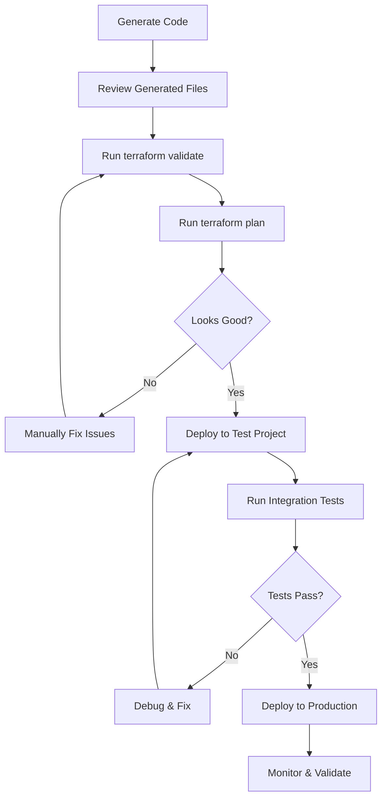

# Testing Generated Terraform Code

## The Challenge

**You're absolutely right** - the generated Terraform code is validated for syntax and structure, but **not tested against real GCP infrastructure**. This means:

❌ Code may have valid syntax but incorrect resource configurations  
❌ IAM permissions might be wrong  
❌ Service quotas might be exceeded  
❌ Resource dependencies might fail  
❌ Regional availability might differ from assumptions  

## Current Validation Levels

### What IS Validated

| Level | Tool | What It Checks | Confidence |
|-------|------|----------------|------------|
| **Syntax** | `check_terraform_syntax()` | Balanced braces, quotes, basic structure | 🟡 Low |
| **Format** | `terraform fmt` | Code formatting, HCL syntax | 🟢 Medium |
| **Config** | `terraform validate` | Provider configs, resource syntax, variable references | 🟢 Medium |
| **Plan** | `terraform plan` | Resource graph, missing variables, obvious errors | 🟡 Medium-High |

### What is NOT Validated

❌ **Actual GCP API compatibility** - Does the API accept these exact parameters?  
❌ **Resource creation success** - Will the resource actually be created?  
❌ **IAM permissions** - Do the specified permissions exist and work?  
❌ **Quota limits** - Will you hit project quotas?  
❌ **Cross-resource integration** - Will Cloud Run actually connect to Cloud SQL?  
❌ **Regional availability** - Is the service available in your region?  
❌ **Cost estimation** - How much will this actually cost?  

## Recommended Testing Strategy

### 1. Local Validation (Done by System)

```bash
# The agents already do this:
terraform fmt
terraform validate  
terraform plan
```

**Confidence: ~60%** - Catches syntax and basic config errors

### 2. Isolated Test Environment (You Should Do This)

Create a dedicated GCP test project:

```bash
# Create test project
gcloud projects create terraform-test-$(date +%s) --name="Terraform Test"

# Set as active
gcloud config set project terraform-test-XXXXX

# Deploy generated code
cd output/demo_TIMESTAMP/environments/prod
cp terraform.tfvars.example terraform.tfvars
# Edit terraform.tfvars with test project ID

terraform init
terraform plan
terraform apply -auto-approve

# Test functionality
# ... verify resources work ...

# Clean up
terraform destroy -auto-approve
```

**Confidence: ~95%** - Tests actual deployment

### 3. Integration Testing

Test that services actually work together:

```bash
# After terraform apply in test environment:

# Test Cloud Run is accessible
SERVICE_URL=$(terraform output -raw service_url)
curl -H "Authorization: Bearer $(gcloud auth print-identity-token)" $SERVICE_URL

# Test database connectivity
gcloud sql connect INSTANCE_NAME --user=appuser

# Test storage access
gsutil ls gs://$(terraform output -raw storage_bucket)

# Check IAM permissions
gcloud projects get-iam-policy PROJECT_ID \
  --flatten="bindings[].members" \
  --filter="bindings.members:serviceAccount:*"
```

**Confidence: ~99%** - Verifies end-to-end functionality

## Automated Testing Approach

### Option A: Add Testing Phase to Agent System

We could add a **Testing Agent** that:

```python
# Pseudocode for future enhancement
class TestingAgent:
    def test_generated_code(self, terraform_code, test_project_id):
        # 1. Deploy to test project
        deploy_result = self.deploy_to_test_env(terraform_code, test_project_id)
        
        # 2. Run integration tests
        test_results = self.run_integration_tests(deploy_result)
        
        # 3. Clean up
        self.destroy_resources(test_project_id)
        
        # 4. Report results
        return test_results
```

**Pros:**
- Catches real-world issues
- Validates actual GCP integration
- Provides confidence before production

**Cons:**
- Requires GCP credentials with create permissions
- Costs money (though minimal for tests)
- Takes longer (~5-10 minutes per generation)
- Complexity and potential for test failures

### Option B: Use Terraform's Built-in Testing

Terraform 1.6+ has native test framework:

```hcl
# tests/simple_test.tftest.hcl
run "validate_cloud_run" {
  command = plan
  
  assert {
    condition     = google_cloud_run_v2_service.app.location == "us-central1"
    error_message = "Cloud Run must be in us-central1"
  }
}

run "check_sql_config" {
  command = plan
  
  assert {
    condition     = google_sql_database_instance.main.settings[0].tier == "db-f1-micro"
    error_message = "SQL tier must be db-f1-micro for cost efficiency"
  }
}
```

We could generate these tests automatically!

### Option C: Mock GCP Provider

Use Terraform's test mode with mocked GCP responses:

```bash
# Override provider with mock
terraform plan -var="project_id=test-project" \
  -var="mock_mode=true"
```

**Pros:**
- Fast
- No cost
- No credentials needed

**Cons:**
- Doesn't catch real API issues
- Limited confidence

## Practical Recommendations

### For Development/Learning

```bash
# 1. Generate code
uv run src/demo.py

# 2. Review manually
cd output/demo_TIMESTAMP/

# 3. Validate locally
terraform validate

# 4. Check plan output carefully
terraform plan | less
```

### For Production Use

```bash
# 1. Generate code
uv run src/demo.py

# 2. Create dedicated test project
gcloud projects create my-terraform-test-001

# 3. Deploy to test
cd output/demo_TIMESTAMP/environments/prod
# Edit terraform.tfvars with test project
terraform init
terraform apply

# 4. Run manual tests
# - Access Cloud Run endpoint
# - Test database connection  
# - Verify IAM permissions
# - Check logs

# 5. If successful, deploy to production
# Edit terraform.tfvars with prod project
terraform workspace new production
terraform apply

# 6. Clean up test
terraform workspace select default
terraform destroy
```

## What We Could Add

### Enhancement Ideas

1. **Post-Generation Validation Script**
   ```bash
   # scripts/validate_generated.sh
   cd $OUTPUT_DIR
   terraform init
   terraform validate
   terraform plan -out=plan.tfplan
   terraform show -json plan.tfplan | jq '.resource_changes | length'
   ```

2. **Integration Test Generator**
   - Generate test scripts alongside Terraform code
   - Include curl commands, gcloud checks, etc.

3. **Cost Estimation**
   - Integrate with `infracost` to estimate costs
   - Warn if estimated cost > threshold

4. **Policy Validation**
   - Use `terraform-compliance` for policy checks
   - Validate security best practices
   - Check for overly permissive IAM

5. **Drift Detection**
   - After deployment, check for configuration drift
   - Compare desired vs actual state

## The Reality

### Current System Confidence

**Generated code confidence: ~70%**
- ✅ Syntax is valid
- ✅ Structure is correct
- ✅ Best practices followed
- ⚠️ May need minor adjustments
- ⚠️ Untested against real GCP

### With Manual Testing

**After you test in isolated project: ~95%**
- ✅ Everything from above
- ✅ Proven to deploy successfully
- ✅ Services actually work
- ✅ Integrations verified

### Why Not Test Automatically?

We could, but it requires:
1. **User consent** - Running real infrastructure costs money
2. **Credentials** - Need GCP project with permissions
3. **Time** - Adds 5-10 minutes to generation
4. **Cleanup** - Must reliably destroy test resources

**Better approach:** Generate high-quality code + provide testing guide (this document)

## Best Practice Workflow



## Conclusion

**The honest answer:** 

The generated code is **structurally sound** and follows **best practices**, but should be **tested in an isolated environment** before production use.

Think of this system as a **highly skilled junior engineer** - it writes good code based on patterns and knowledge, but you (the senior engineer) should review and test before deploying to production.

**Recommendation:** Always test generated infrastructure in a dedicated test GCP project before deploying to production.
